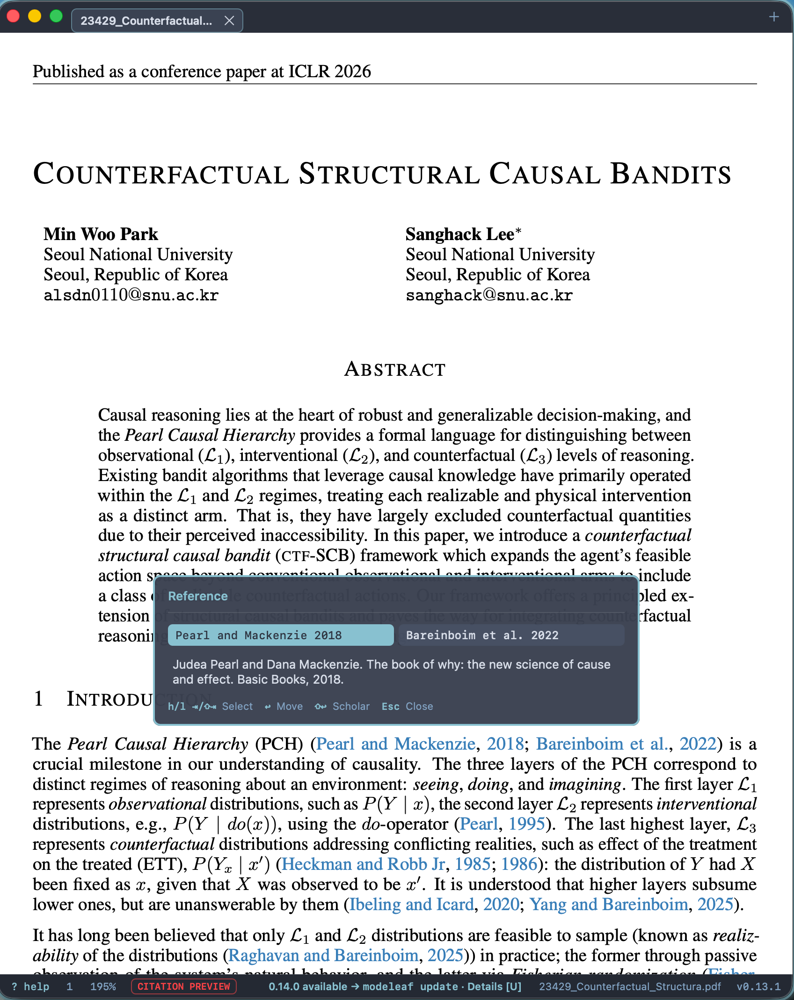

<div align="center">
  
  <h1>Modeleaf</h1>
</div>

A native, read-only macOS PDF viewer — keyboard-first, Vim-flavored, with native tabs and a minimal interface.
> **Windows:** [Modeleaf for Windows](https://github.com/DS-argus/modeleaf-win) is actively evolving. See its README for current features and limitations.

[Korean](docs/README.md)

https://github.com/user-attachments/assets/1fd81fb3-b600-403c-bcfb-5365aa867503

## Philosophy

- **Read-only.** No annotations, editing, or saving. The source PDF is never modified.
- **Keyboard-first.** Inspired by [Sioyek](https://github.com/ahrm/sioyek), [SumatraPDF](https://github.com/sumatrapdfreader/sumatrapdf), [Vimium](https://github.com/philc/vimium), and the Markdown TUI [Leaf](https://github.com/RivoLink/leaf), while staying deliberately focused on reading.
- **Configurable.** Most commands and reader behavior can be remapped in one TOML file.

## Key features

- Keyboard-first navigation, search, link hints, and embedded-outline TOC
- Native tabs and a recent-file picker
- Password-protected local PDFs with a native secure prompt; passwords are never saved
- Command palette and seven built-in themes
- Fit, zoom, rotation, history, and system printing
- TOML-configurable commands and reader behavior

## Experimental Features

### Citation preview

Preview cited references without leaving the text you are reading.

- **Enable:** Press `Shift+C` to toggle. It defaults to OFF, and your choice is saved.
- **Use:** Press `f` to show link hints, then select a citation link.
- **Navigate:** Use `h` / `l` or `Tab` / `Shift+Tab` to switch references, `Enter` to jump to the reference, `Shift+Enter` to search for it on Google Scholar, and `Esc` to close.
- **Representative citation formats:** Support focuses on formats commonly used in AI conference papers, such as `[1]`, `[1,3]`, `[1–3]`, `(1; 2)`, `(Author, 2020)`, `(Author, 2020a,b)`, and `[HKR16; Pat+23]`.

The PDF must contain existing internal citation links. Depending on its link structure, text, and layout, some references may be unavailable or extracted incorrectly. Superscript citations and citations without links are outside the supported scope.

<details>
<summary>View citation preview screenshot</summary>



</details>

## Install

```sh
brew tap DS-argus/tap
brew trust DS-argus/tap
brew install --cask modeleaf
```

Requires macOS 14 (Sonoma) or newer.

> This build is ad-hoc signed and not yet Apple-notarized. On first launch, allow it in **System Settings → Privacy & Security → Open Anyway**.

## Command line

The Homebrew cask installs the `modeleaf` command alongside the app.

```sh
modeleaf                         # launch or activate Modeleaf
modeleaf document.pdf            # open a PDF in the existing app
modeleaf *.pdf                   # open multiple PDFs as tabs
modeleaf --new document.pdf      # open in a separate app instance
modeleaf update                  # update through Homebrew
modeleaf remove                  # uninstall without deleting configuration
modeleaf --version               # or: modeleaf -v
modeleaf --help
```

Shells expand globs before Modeleaf receives them. Use `modeleaf open -- <path>` when a path starts with a hyphen or matches a command name.

## Update

Use Modeleaf's update command so the installed CLI and cask stay in sync:

```sh
modeleaf update
```

If Homebrew reports that Modeleaf is already up to date while a newer release is listed on GitHub, refresh its metadata and retry:

```sh
brew update --force
modeleaf update
```

Modeleaf checks [GitHub Releases](https://github.com/DS-argus/modeleaf/releases) at launch but never updates itself.

## Keys (defaults)

| Action                              | Key                           |
| ----------------------------------- | ----------------------------- |
| Scroll / large scroll               | `h` `j` `k` `l` / `d` `u`     |
| Previous / next page                | `p` / `n`                     |
| First / last page                   | `gg` / `G`                    |
| Go to page                          | `g`, number, `Enter`          |
| Back / forward                      | `Ctrl+o` / `Ctrl+i`           |
| TOC / move / jump                   | `t` / `J` `K` / number        |
| Search / next / previous result     | `/` / `Enter` / `Shift-Enter` |
| Link hints / indicator settings     | `f` / `I`                     |
| Fit width / page                    | `w` / `F`                     |
| Zoom / rotate                       | `=` `-` / `[` `]`             |
| Copy PDF path / reveal in Finder   | `yy` / `of`                   |
| Open / close / print / quit         | `⌘o` / `⌘w` / `⌘p` / `⌘q`     |
| Previous / next tab                 | `P` / `N`                     |
| Split / focus pane | `Ctrl-b \|` `Ctrl-b -` / `Ctrl-h/j/k/l` |
| Theme / palette / help              | `T` / `:` / `?`               |

`y` previews the full PDF path; `yy` copies it and adds `copied!`. Each input refreshes the three-second display; the default key-sequence timeout remains 400 ms. Long paths are middle-truncated with the full path available in a tooltip.

External URL hints display the destination URL on selection. Press Enter once to open it, or Escape to close the prompt. Held-key repeats do not open links. Internal PDF destinations are unchanged.

The status bar adapts down to the existing 480 × 360 pt minimum window: it keeps every item on one line, prioritizes temporary path/key feedback and compact search results, and hides lower-priority basic items in order (version, help, zoom, fit badge, page). Optional notices and update text appear only when they fit. Errors that do not fit retain an `Error` button for their full details.

## Configuration

Modeleaf reads an optional TOML config:

```text
~/.config/modeleaf/config.toml
```

Keys use `D` (Command), `C` (Control), `A` (Option), and `S` (Shift). Use **Write Default Config**, **Reload Config**, or **Reset Config** from the command palette. See [CONFIG.md](CONFIG.md) for every action, default, and validation rule. External link hint confirmation can be disabled with `[links] skip_external_link_hint_confirmation = true`; it is enabled by default.

## Build from source

```sh
APP=$(Tools/build_release_app.sh | tail -n 1)
open "$APP"
```

For development, use `swift run Modeleaf`. Run `Tools/verify.sh full` before opening a pull request.

## Release preparation

For each release, maintainers add `release-notes/<version>.txt` (without the `v` tag prefix), for example `release-notes/0.13.0.txt`. Write 2-5 concise English, user-facing bullets based on the actual changes since the preceding release; each non-empty line must be a Markdown bullet beginning with `- `, and placeholders are not accepted.

Push only the matching `v<version>` tag, such as `v0.13.0`. The workflow verifies the tag, runs tests, packages the app, creates or updates a draft release with one `## Highlights` section plus GitHub's generated details, updates Homebrew, and then publishes. Rerunning a tag refreshes only its draft and keeps generated notes; an already-published release is never rewritten.

## License

Modeleaf is available under the [MIT License](LICENSE).

Theme palette attributions: [ThemeAttributions.md](PDFReaderApp/Theme/ThemeAttributions.md)
